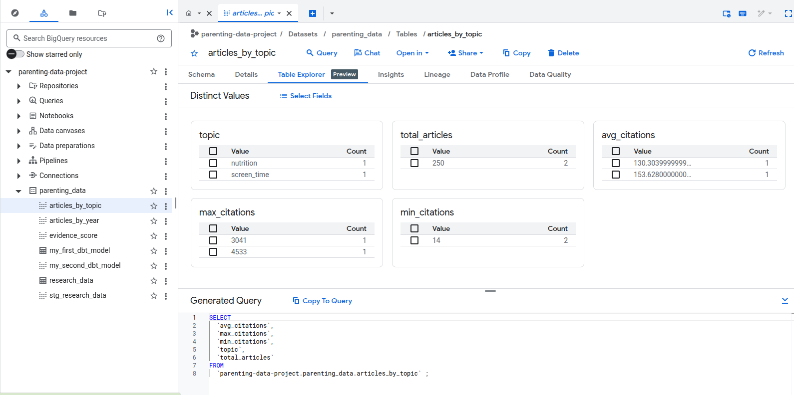
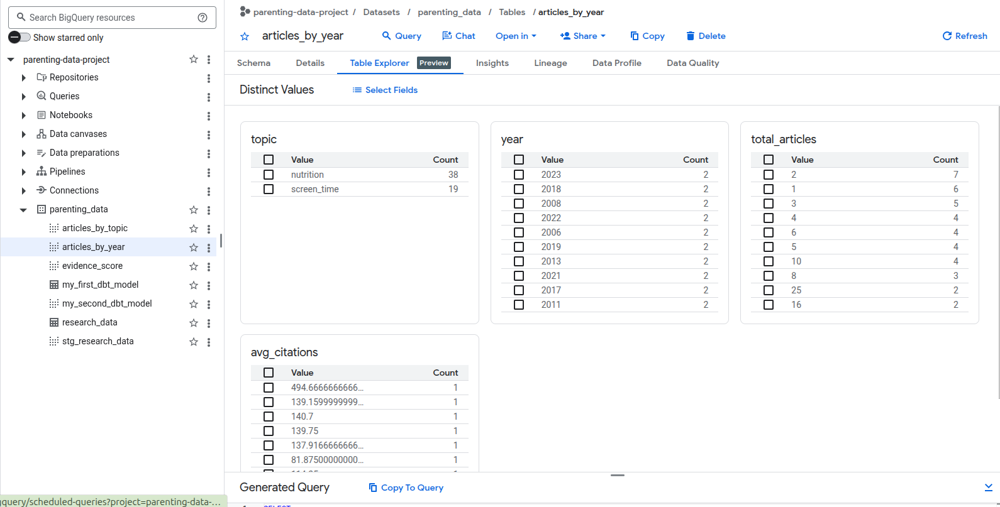
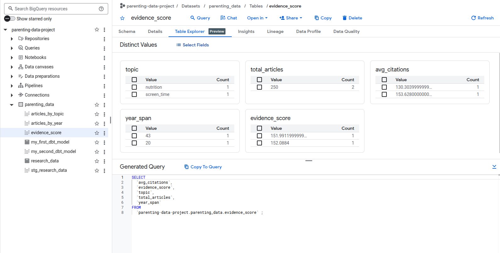

# 📊 Evidence-Based Parenting Data Pipeline

## 🚀 Overview
This project builds a complete data pipeline to analyze global research trends on:

- Screen time in children
- Child nutrition

The goal is to transform raw academic data into actionable insights using modern data tools.

---

## 🧠 Architecture

This architecture follows a modern ELT pattern using dbt for transformation and BigQuery as the analytical data warehouse.

    ┌──────────────┐
    │  OpenAlex API│
    └──────┬───────┘
           ↓
    ┌──────────────┐
    │   Python ETL │
    │ (data fetch) │
    └──────┬───────┘
           ↓
    ┌──────────────┐
    │   BigQuery   │
    │ (raw layer)  │
    │ research_data│
    └──────┬───────┘
           ↓
    ┌──────────────┐
    │     dbt      │
    │ transformation│
    └──────┬───────┘
           ↓
┌─────────────────────────┐
│ Data Models │
├─────────────────────────┤
│ stg_research_data │     |
│ articles_by_topic │     |
│ articles_by_year │      |
│ evidence_score │        |
└─────────────────────────┘
## ⚙️ Tech Stack

- Python (API ingestion)
- BigQuery (Data warehouse)
- dbt (Data transformation)
- GitHub (Version control)

---

## 📊 Data Models

### 🟫 Raw
- `research_data`: raw dataset from OpenAlex API

### 🟪 Staging
- `stg_research_data`: cleaned and standardized data

### 🟨 Mart (Analytics)

- `articles_by_topic`: research volume and impact
- `articles_by_year`: trend analysis
- `evidence_score`: custom scoring model

---

## 🔥 Key Insight

A custom Evidence Score was designed combining:

- Research volume
- Citation impact
- Time coverage

---

## 📈 Example Insight

Screen time research demonstrates higher volume and citation impact compared to child nutrition, indicating stronger academic attention and influence.

---

## 📊 Results & Data Preview

## 📌 Future Improvements

- Add Airflow for orchestration
- Build dashboard (Power BI / Tableau)
- Improve scoring model
